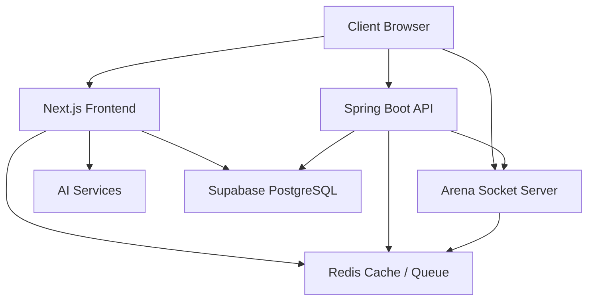
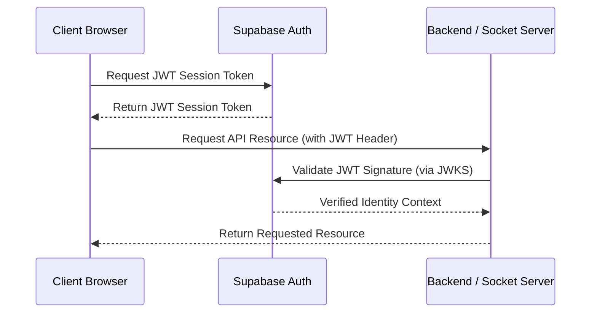
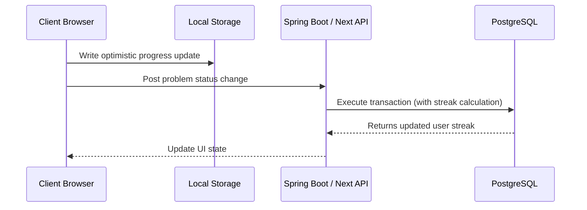
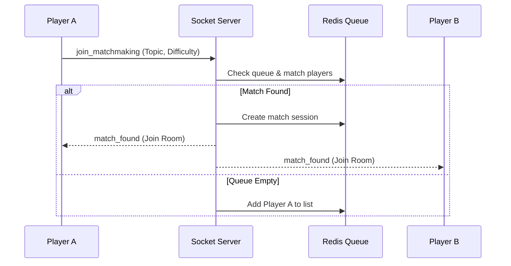
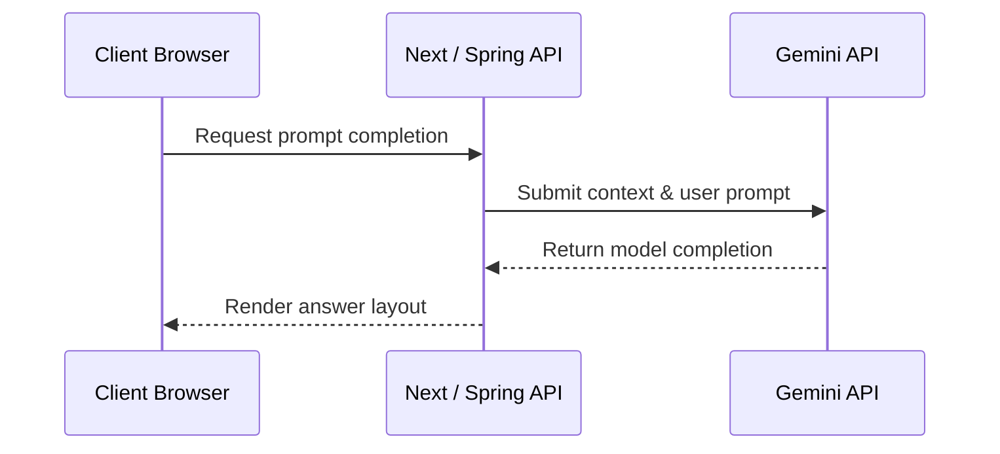

# AlgoBuddy Architecture Guide

This document describes the high-level system architecture of **AlgoBuddy**. It defines the core component boundaries, state ownership, communication contracts, and extension patterns for developers.

For developer environment setups and installation steps, see [README.md](./README.md).

---

## 1. Project Overview

AlgoBuddy is a learning and practice platform for Data Structures and Algorithms (DSA). It features step-by-step algorithm visualizers, real-time peer-to-peer coding duels, and AI-assisted study tools.

The platform comprises three runtimes:

*   **Next.js Frontend**: Serves the user interface and executes untrusted code in a sandboxed runner.

*   **Spring Boot Backend**: Serves as the database source of truth, managing user profiles, statistics, and sheets.

*   **Arena Socket Server**: A WebSocket gateway that manages peer-to-peer matchmaking, live duel states, and spectator rooms.

---

## 2. System Architecture

The diagram below shows the boundaries of the system and the communication paths between components.

AlgoBuddy uses a decentralized client-server architecture. The Client Browser acts as the central coordinator, communicating asynchronously with the Next.js edge functions (for user sessions and isolated execution), the Spring Boot API (for profile data and persistence), and the stateful Node.js Arena Socket server (for multiplayer duels).

---

## 3. Major Components

To scale services independently and maintain clear boundaries, the codebase is split into five functional components:

### 3.1 Frontend
The Frontend is a Next.js application that serves user pages, visualizer interfaces, practice dashboards, and duels. It is responsible for client-side state engines, visualizer timelines, and caching guest state locally. It communicates with other components via REST endpoints and WebSocket protocols.

### 3.2 Backend
The Backend is a Spring Boot application that manages business logic, database operations, and persistent data models. It tracks user profile levels, calculates practice achievements, and computes Elo rating updates. It connects directly to PostgreSQL and Redis cache, exposing a REST API for authenticated user sessions.

### 3.3 Real-time Service
The Real-time Service is a Node.js Socket.io server that handles matchmaking and live duels. It pairs users, distributes code typing status, monitors user connection drops, and routes spectator lobbies. It relies on Redis to maintain queue states across instances, broadcasting match events via WebSockets.

### 3.4 Database
The Database is a Supabase PostgreSQL instance that serves as the persistent data store. It manages user progress tracking, bookmark tables, and activity logs. Access is governed by database-level triggers and Row-Level Security (RLS) policies based on authenticated user IDs.

### 3.5 AI Services
The AI Services integrate with Google Gemini LLM APIs to provide coding hints, dry-run debugging, and study planning. These services process prompts submitted from the frontend or backend layers, returning contextual guidance.

---

## 4. Repository Organization

Code ownership is mapped to top-level directories to isolate execution contexts:

*   **Frontend UI ([src/](./src))**: Next.js App Router, custom hooks, reusable components, and client-side utilities.

*   **Business Logic ([backend/](./backend))**: Spring Boot models, REST controllers, JPA repository layers, and Elo calculators.

*   **Stateful Networking ([arena-socket-server/](./arena-socket-server))**: Real-time duel handlers, matchmaking routines, and Redis connections.

*   **Shared Configurations & Migration Database Scripts ([supabase_setup.sql](./supabase_setup.sql) & [backend/*.sql](./backend))**: Defines configurations and SQL table schemas (managed manually through CLI scripts or Supabase console updates).

---

## 5. Request & Data Flow

### 5.1 Authentication Flow

User sessions are managed via Supabase, with sessions verified across services using JSON Web Tokens (JWT). The browser passes this JWT in the Authorization headers of API and WebSocket connections. Backend servers verify the token using Supabase's JWKS endpoint.

### 5.2 Learning Flow

Progress updates are saved locally for responsiveness before being sent to the backend. The backend updates PostgreSQL, which runs a database-level transaction to update streaks.

### 5.3 Arena Flow

Matchmaking uses Redis lists. The Socket Server matches players, creates a room, and broadcasts the session details. Clients then update their game state via the REST API.

### 5.4 AI Flow

AI prompts are processed through server-side APIs to protect API keys. The APIs validate the request, call Gemini, and return the response.

---

## 6. Architectural Decisions

### 6.1 Separation of Spring Boot and Socket Server
Spring Boot is optimized for transactional database operations (REST API), while Node.js/Socket.io is optimized for stateful, event-driven WebSocket connections. Separating them allows independent scaling and prevents connection surges from impacting persistence.

### 6.2 Next.js Serverless Layer
Provides static and server-side rendering for landing pages, simple routing, and handles sandboxed user code execution (`isolated-vm`) at the edge, protecting core backend resources.

### 6.3 Redis Cache & Queue
Offers fast, in-memory operations needed for real-time matchmaking queues, and acts as a distributed cache to reduce database load.

### 6.4 Supabase for Auth & Database
Provides built-in user authentication, email validation, and a Postgres database with Row-Level Security, reducing boilerplate code.

### 6.5 Separate Real-Time Networking
Decouples the live game engine from business APIs, allowing the socket server to run independently of persistent storage.

---

## 7. Extension Guide

Contributors should follow these conventions when introducing changes:

*   **Pages**: Add folder in [src/app/](./src/app) (e.g. `src/app/<route>/page.jsx`)

*   **APIs**: Add serverless endpoint in [src/app/api/](./src/app/api) (e.g. `src/app/api/<route>/route.js`)

*   **Services / Hooks**: Add custom hook in [src/app/hooks/](./src/app/hooks)

*   **Shared UI Components**: Place inside [src/components/ui/](./src/components/ui)

*   **Backend Endpoints**: Define inside the controller layer under [backend/src/main/java/com/algobuddy/backend/controller/](./backend/src/main/java/com/algobuddy/backend/controller)

*   **Backend Services**: Implement under [backend/src/main/java/com/algobuddy/backend/service/](./backend/src/main/java/com/algobuddy/backend/service)

*   **Socket Events**: Register listeners in [arena-socket-server/index.js](./arena-socket-server/index.js) using `socket.on(...)`

### Architectural Boundaries

*   Never allow the frontend to access the database directly.

*   Keep the Socket Server stateless by storing matchmaking queues and active match rooms in Redis.

*   Restrict data access in PostgreSQL using Row-Level Security (RLS) policies.

*   Style components using Tailwind tokens from [design.md](./design.md) rather than custom inline styles.

---

## 8. Guiding Principles

*   **Separation of Concerns**: Decouple layout rendering, persistent business rules, and stateful real-time interactions.

*   **Modular Design**: Build features (like visualizers and notes) as isolated components to prevent side effects.

*   **Service Ownership**: Keep the Next.js client, Spring Boot API, and Socket Server independent, communicating only through defined APIs.

*   **Local-First & Optimistic Rendering**: Update the UI instantly using local state before syncing with backend servers for a smooth user experience.

*   **Security by Design**: Enforce authorization checks at all layers (middleware, controllers, and database RLS).
